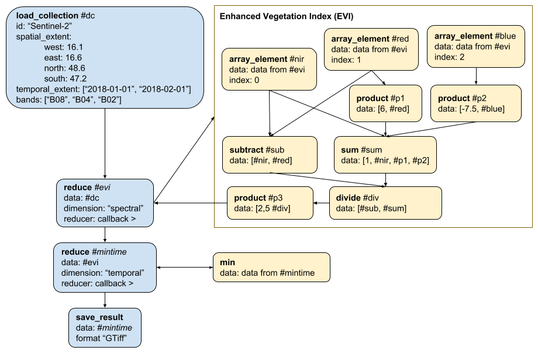

# EVI (Enhanced Vegetation Index)

This example derives minimum EVI measurements over pixel time series of Sentinel 2 imagery. The EVI is defined as follows: `(2.5 * (nir - red)) / ((nir + 6.0 * red - 7.5 * blue) + 1.0)`

The process graph could be visualized as follows:



This process graph is meant to be used as batch job or can be lazy evaluated. It returns a GeoTiff file with the computed results.

This process graph assumes the dataset is called `Sentinel-2`. The temporal extent covered is January 2018 and bands `B02` (blue), `B04` (red) and `B08` (nir) are used for the computation. Please note that the order of the bands in `get_collection` is important as they are requested by their order (index) in the callback.

## Process Graph

```json
{
  "dc": {
    "process_id": "load_collection",
    "description": "Loading the data; The order of the specified bands is important for the following reduce operation.",
    "arguments": {
      "id": "Sentinel-2",
      "spatial_extent": {
        "west": 16.1,
        "east": 16.6,
        "north": 48.6,
        "south": 47.2
      },
      "temporal_extent": ["2018-01-01", "2018-02-01"],
      "bands": ["B08", "B04", "B02"]
    }
  },
  "evi": {
    "process_id": "reduce",
    "description": "Compute the EVI. Formula: 2.5 * (NIR - RED) / (1 + NIR + 6*RED + -7.5*BLUE)",
    "arguments": {
      "data": {"from_node": "dc"},
      "dimension": "spectral",
      "reducer": {
        "callback": {
          "nir": {
            "process_id": "array_element",
            "arguments": {
              "data": {"from_argument": "data"},
              "index": 0
            }
          },
          "red": {
            "process_id": "array_element",
            "arguments": {
              "data": {"from_argument": "data"},
              "index": 1
            }
          },
          "blue": {
            "process_id": "array_element",
            "arguments": {
              "data": {"from_argument": "data"},
              "index": 2
            }
          },
          "sub": {
            "process_id": "subtract",
            "arguments": {
              "data": [{"from_node": "nir"}, {"from_node": "red"}]
            }
          },
          "p1": {
            "process_id": "product",
            "arguments": {
              "data": [6, {"from_node": "red"}]
            }
          },
          "p2": {
            "process_id": "product",
            "arguments": {
              "data": [-7.5, {"from_node": "blue"}]
            }
          },
          "sum": {
            "process_id": "sum",
            "arguments": {
              "data": [1, {"from_node": "nir"}, {"from_node": "p1"}, {"from_node": "p2"}]
            }
          },
          "div": {
            "process_id": "divide",
            "arguments": {
              "data": [{"from_node": "sub"}, {"from_node": "sum"}]
            }
          },
          "p3": {
            "process_id": "product",
            "arguments": {
              "data": [2.5, {"from_node": "div"}]
            },
            "result": true
          }
        }
      }
    }
  },
  "mintime": {
    "process_id": "reduce",
    "description": "Compute a minimum time composite by reducing the temporal dimension",
    "arguments": {
      "data": {"from_node": "evi"},
      "dimension": "temporal",
      "reducer": {
        "callback": {
          "min": {
            "process_id": "min",
            "arguments": {
              "data": {"from_argument": "data"}
            },
            "result": true
          }
        }
      }
    }
  },
  "save": {
    "process_id": "save_result",
    "arguments": {
      "data": {"from_node": "mintime"},
      "format": "GTiff"
    },
    "result": true
  }
}
```

## Result

TBD