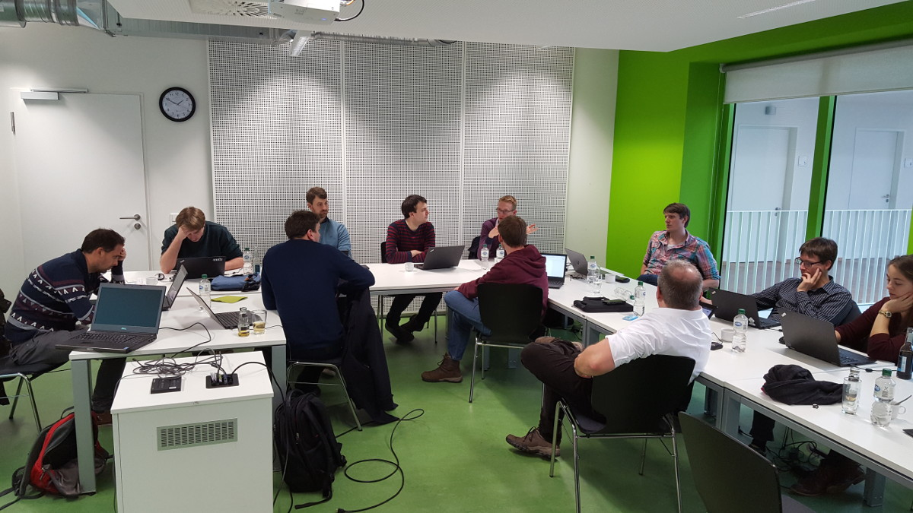

On Jan 22-24, the [Institute for Geoinformatics](https://www.uni-muenster.de/Geoinformatics/en/index.html) at the University of Muenster hosted
the _second week of intense collaboration_. 16 developers from 8 partners worked on implementing the proof of concept use cases for different clients and backends, improving the core API, and connecting the clients to different backends. 

We continued implementing the [GeoTrellis](https://github.com/Open-EO/openeo-geopyspark-driver), [WCPS](https://github.com/Open-EO/openeo-wcps-driver), [GRASS GIS](https://github.com/Open-EO/openeo-grassgis-driver), and [Sentinel Hub](https://github.com/Open-EO/openeo-sentinelhub-driver) backend drivers and a [Python client](https://github.com/Open-EO/openeo-python-client) for OpenEO, which we started during our [meeting in December at VITO](http://openeo.org/openeo/news/2017/12/18/VITO_meeting.html).

Besides many improvements in the proof of concept implementations, this week resulted in two more prototypical OpenEO clients:  

-  A simple browser-based [JS client](https://github.com/Open-EO/openeo-js-client) was tested with the [Sentinel Hub driver](https://github.com/Open-EO/openeo-sentinelhub-driver) and its implementation of the first proof of concept use case (computing minimum NDVI values over time series of Sentinel 2 data).
- The [openeo R package](https://github.com/Open-EO/openeo-r-client) also implements the first use case and demonstrates how R users will communicate with OpenEO backends.

During the three days, we also discussed important ideas of the core API specification and how it can be improved by supporting synchronous processing and representing descriptions of process chains as resources. [EODC](https://www.eodc.eu/) presented its new [OpenShift](https://www.openshift.com/)-based architecture to run OpenEO queries in containers. Further important discussions made clear how our proof of concept in month 6 will look like. 

More details of the week's results can be found in our [GitHub](https://github.com/Open-EO) repositories. 

